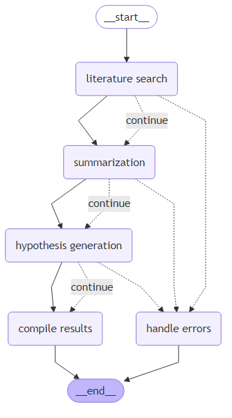
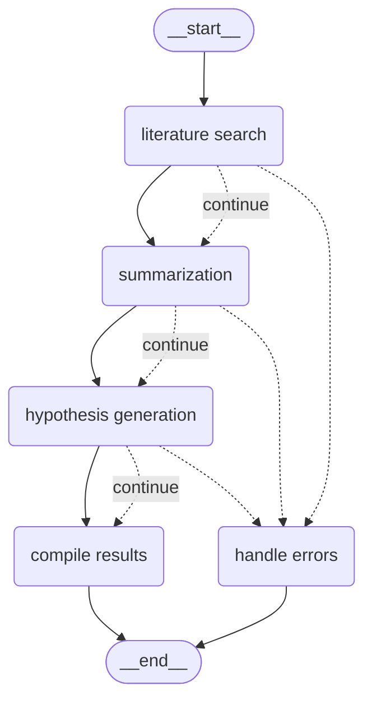

# AgenticAI Research Assistant



AgenticAI Research Assistant is a cutting-edge research automation system designed to streamline the academic research process using a multi-agent architecture built on advanced AI frameworks including Agno, LangChain, and LangGraph.

## Overview

This project implements an intelligent research pipeline that automates multiple stages of the research process:

1. **Literature Search** - Discovers and retrieves relevant academic papers from arXiv and other sources
2. **Summarization** - Synthesizes key information from the retrieved papers
3. **Hypothesis Generation** - Analyzes research gaps and generates testable hypotheses
4. **Results Compilation** - Organizes findings into a comprehensive research report

The system uses a directed graph workflow to coordinate these specialized agents, with built-in error handling and recovery mechanisms.

## Project Architecture

### Multi-Agent Pipeline

The AgenticAI Research Assistant employs a sophisticated multi-agent architecture:

- **Literature Search Agent**: Uses ArxivTools and DuckDuckGoTools to retrieve high-quality academic papers
- **Summarization Agent**: Condenses and synthesizes the retrieved literature using vector similarity search
- **Hypothesis Generation Agent**: Identifies research gaps and generates testable hypotheses
- **Orchestration Layer**: Manages the workflow using LangGraph for agent coordination

### Key Technologies

- **Agno**: Framework for building intelligent agent systems
- **LangChain**: For managing and chaining various AI components
- **LangGraph**: For visualizing and orchestrating agent workflows
- **FAISS**: Fast similarity search for efficient information retrieval
- **OpenAI API**: For advanced language model capabilities

## Installation

### Prerequisites

- Python 3.11+
- OpenAI API key

### Option 1: Setup with pip

1. Clone the repository:
   ```bash
   git clone https://github.com/chandankumar123456/ResearchAgent.git
   cd ResearchAgent
   ```

2. Install dependencies:
   ```bash
   pip install -r requirements.txt
   ```

3. Set up your environment variables:
   ```bash
   cp .env.example .env
   # Edit .env to add your OpenAI API key
   ```

### Option 2: Install as a package

1. Clone the repository:
   ```bash
   git clone https://github.com/chandankumar123456/ResearchAgent.git
   cd ResearchAgent
   ```

2. Install the package in development mode:
   ```bash
   pip install -e .
   ```

3. Set up your environment variables:
   ```bash
   cp .env.example .env
   # Edit .env to add your OpenAI API key
   ```

## Usage

### Command Line Interface

Run the main script to start the research assistant:

```bash
python main.py
```

You will be prompted to enter your research topic or question. The system will then:

1. Execute the literature search agent to find relevant papers
2. Process and summarize the findings
3. Generate hypotheses and identify research gaps
4. Compile everything into a comprehensive research report

### LangGraph Studio Integration

The project includes LangGraph configuration (`langgraph.json`) for workflow management. To visualize and interact with the workflow using LangGraph CLI:

```bash
langgraph-dev
```

This will start the LangGraph interface, allowing you to visualize and test the research workflow through the command line interface.

## Workflow Diagram

The research pipeline is organized as a directed graph:



## Vector Database Storage

The system uses FAISS vector databases to store:

- Literature search results (`literatureSearchAgentText`)
- Summarized content (`summarizationAgentText`)
- Generated hypotheses (`hypothesisGenerationAgentText`)

You can view the content of these databases using:

```bash
python view_db_content.py
```

## Development

### Project Structure

```
ResearchAgent/
├── Agents/
│   ├── hypothesisGenerationAgent.py
│   ├── literatureSearchAgent.py
│   └── summarizationAgent.py
├── Graph/
│   ├── GraphBuilder/
│   │   └── graph_builder.py
│   ├── Nodes/
│   │   ├── compile_results_node.py
│   │   ├── hypothesis_generation_node.py
│   │   ├── literature_search_node.py
│   │   ├── state.py
│   │   └── summarization_node.py
│   └── diagram.mmd
├── utils/
│   ├── loadapi.py
│   └── vector_db_helper.py
├── main.py
├── requirements.txt
├── setup.py
└── langgraph.json
```

### Adding New Agents

To extend the system with new research capabilities:

1. Create a new agent class in the `Agents/` directory
2. Add a corresponding node in the `Graph/Nodes/` directory
3. Update the `graph_builder.py` to include the new node in the workflow
4. Update the `state.py` to include new state variables if needed

## Contributing

Contributions are welcome! Please feel free to submit a pull request or open an issue for any suggestions or improvements.

1. Fork the repository
2. Create your feature branch (`git checkout -b feature/amazing-feature`)
3. Commit your changes (`git commit -m 'Add some amazing feature'`)
4. Push to the branch (`git push origin feature/amazing-feature`)
5. Open a Pull Request

<!-- ## License

This project is licensed under the MIT License - see the LICENSE file for details. -->

## Acknowledgments

- Built using Agno and LangChain frameworks
- Powered by OpenAI models
- Utilizes FAISS for vector similarity search
- Workflow visualization with LangGraph